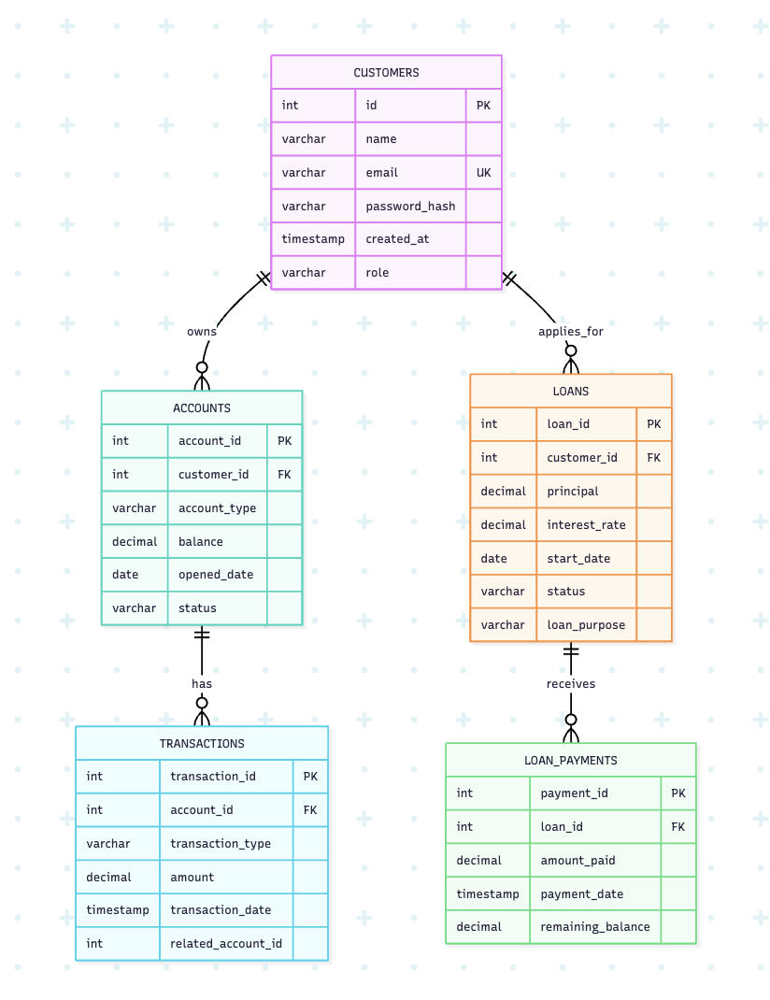
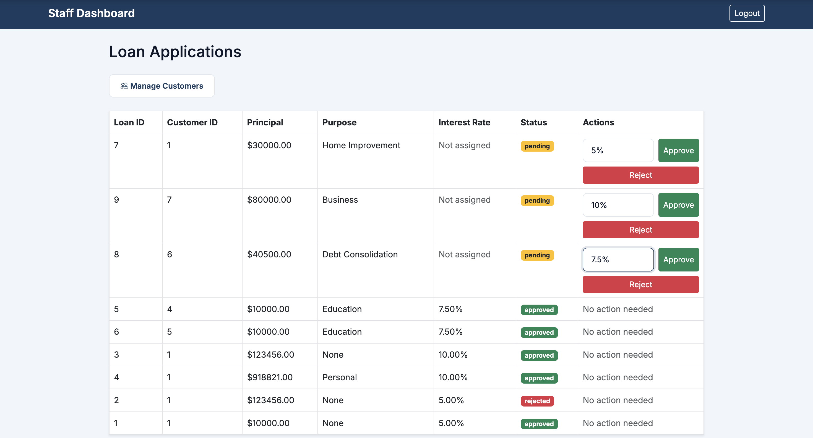
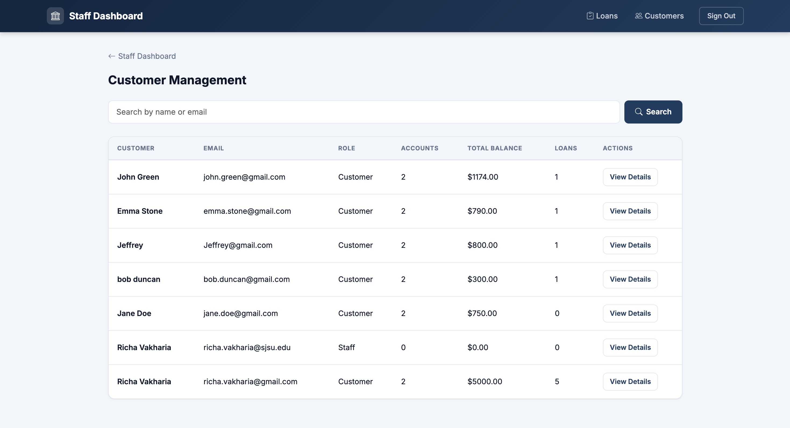
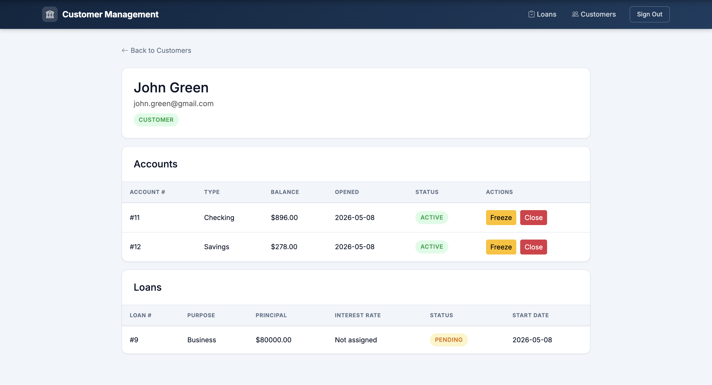
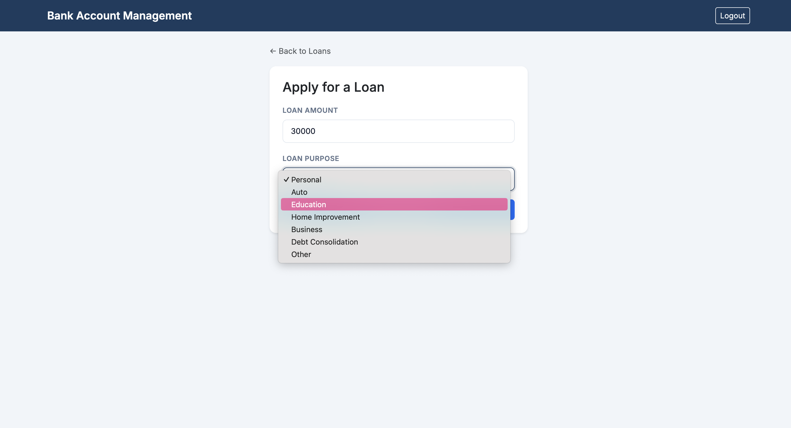

# Relational Banking Database System

A full-stack banking database system built with PostgreSQL, SQL, Python, and Flask. The application supports account management, transaction processing, loan tracking, and role-based admin functionality through a relational database architecture.

## Features

- Customer account creation and management
- Deposit, withdrawal, and transfer functionality
- Loan application and approval workflows
- Role-based staff/admin dashboard
- Account freezing and reactivation
- PostgreSQL relational database design with foreign key relationships
- SQL joins, transactions, and backend CRUD operations
- Flask backend with dynamic HTML templates

## Tech Stack

- Python
- Flask
- PostgreSQL
- SQL
- HTML/CSS

## Database Design

The system uses a normalized relational database structure for managing customers, accounts, transactions, loans, and loan payments.



## Application Screenshots

### Staff Dashboard



### Customer Management



### Customer Details



### Loan Application



## Running the Application

1. Install dependencies

```bash
pip install -r requirements.txt
```

2. Configure PostgreSQL and environment variables

3. Run the schema setup

```bash
python seed.py
```

4. Start the Flask server

```bash
python app.py
```

## Concepts Demonstrated

- Relational database schema design
- Foreign key relationships
- SQL joins and transactions
- CRUD operations
- Role-based access control
- Backend data validation
- Flask web application development
- Database normalization